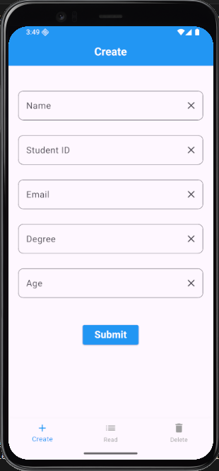
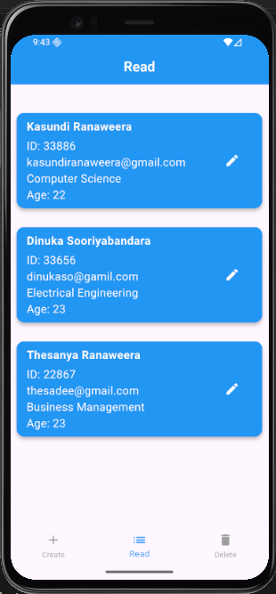
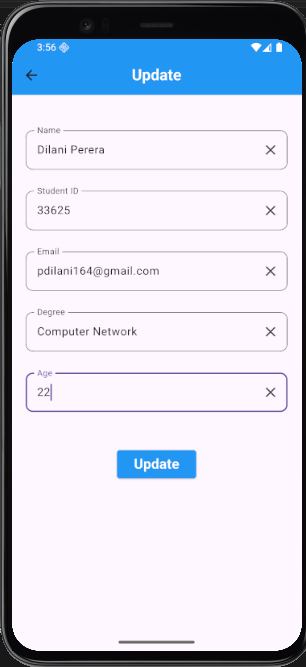
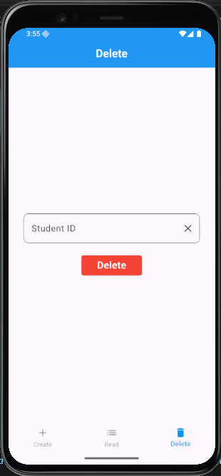

# Student Management App 📱

This is a simple Flutter mobile application that performs CRUD operations using Firebase Firestore.

## Features

- Add student details
- View student records
- Update student information
- Delete student by ID

## Technologies Used

- Flutter
- Firebase Firestore

## Screens

- Create Screen
- Read Screen
- Update Screen
- Delete Screen

## How to Run

1. Clone the repository
2. Run `flutter pub get`
3. Run `flutter run`
4. Run the app

## Screenshots

### Create Screen

### Read Screen

### Update Screen

### Delete Screen

## Author

- Kasundi Ranaweera

